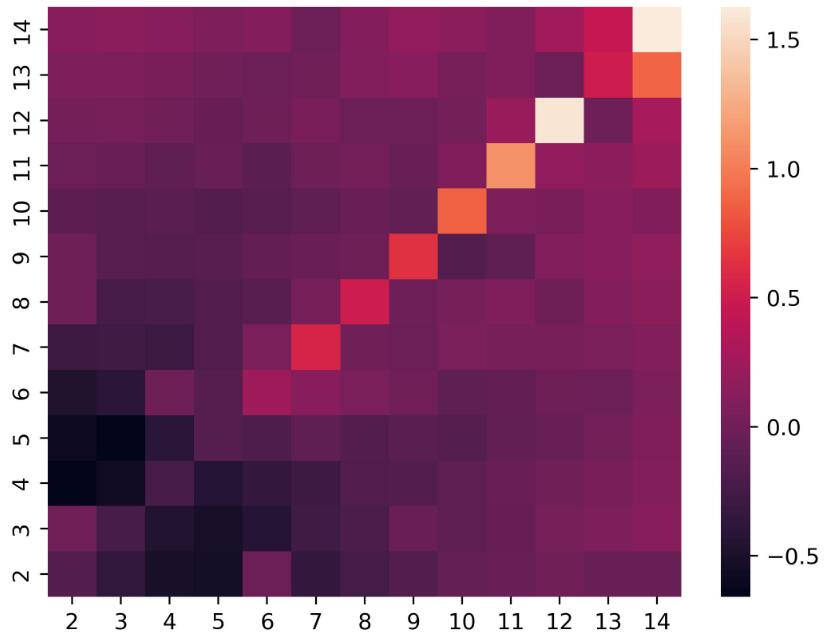
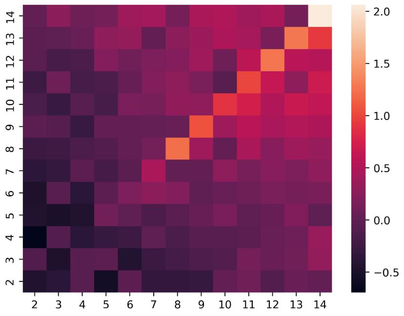
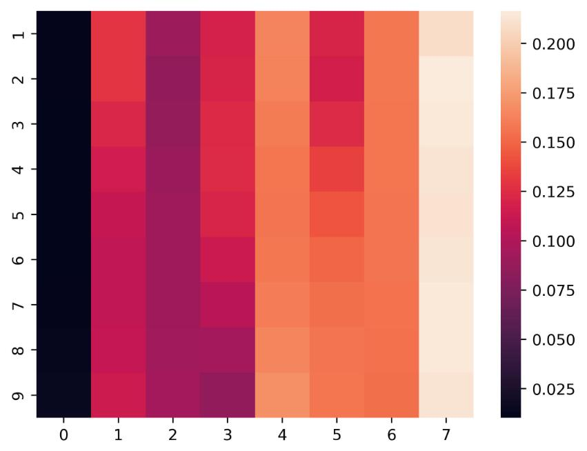
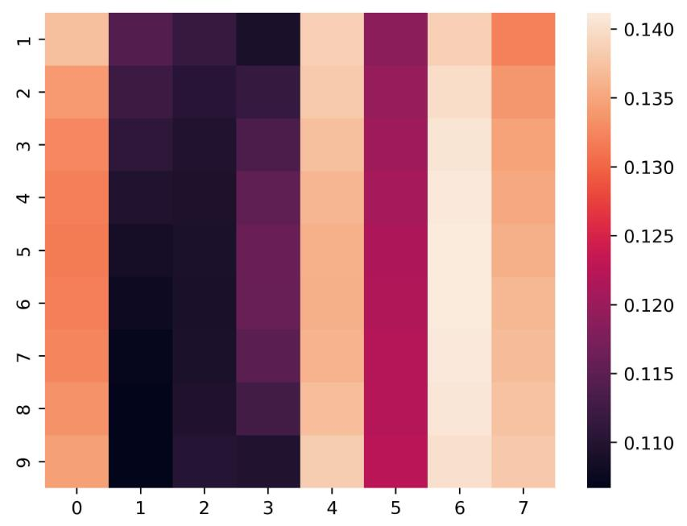

# AI for Texas Hold' em Poker

## Interesting results so far
>  
Expected income (EI) under different Starting hand, off suit, 14 represent A, pre-flop, under the gun. We can see that the better the starting hand, the bigger the EI

> 
Expected income (EI) under different Starting hand, off suit, pre-flop, under the gun + 1, under the gun has all-in. The EI is similar to the previous image, however, because under the gun has all-in, the EI is bigger when AI has AA

> 
Action probability for different betting level of under the gun, pre-flop, under the gun + 1, x-axis represent fold(0) to all-in(7). y-axis represent the betting level of under the gun. We can see that when AI get AA, fold is almost impossible, and the bigger the betting of under the gun, the bigger the AI might bet

> 
Action probability for different betting level of under the gun, pre-flop, under the gun + 1, x-axis represent fold(0) to all-in(7). y-axis represent the betting level of under the gun. We can see that when AI get 22, AI will either fold or betting heavily, will not chose to call